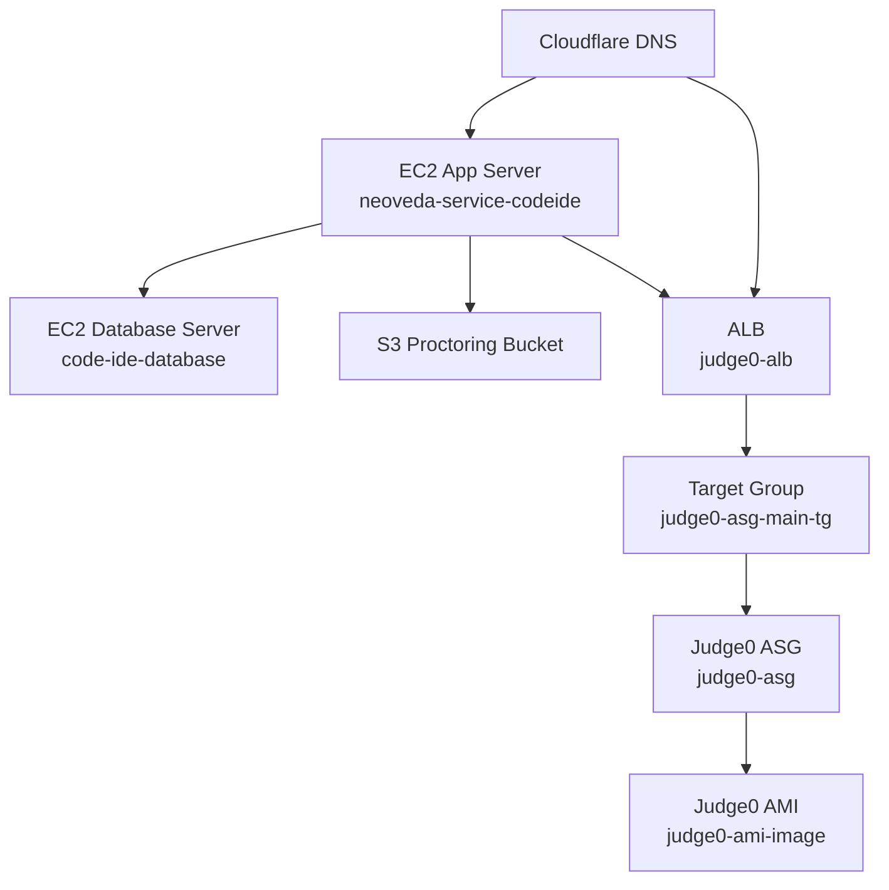
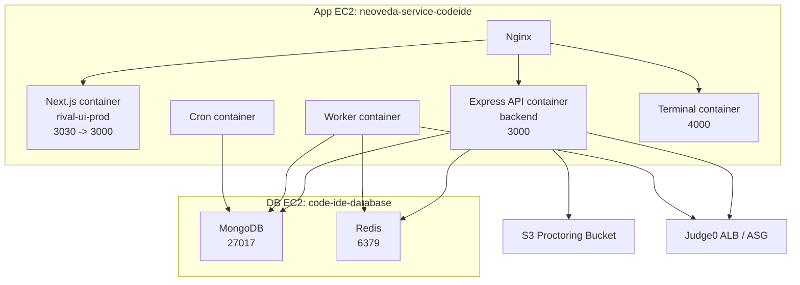
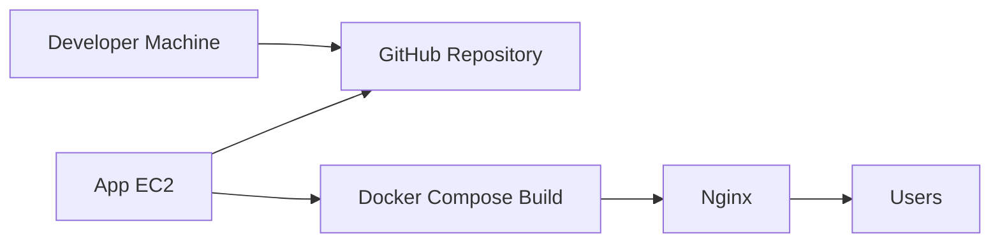

# CODE-IDE DevOps Deployment Runbook

Last updated: 2026-05-08  
AWS account: `928530207421`  
AWS region: `ap-south-1`  
Platform: CODE-IDE / Knovia Lab

## 1. Purpose

This document is for DevOps engineers and future development teams who need to understand how the CODE-IDE platform is currently hosted and how the same style of environment can be recreated.

It documents:

- current AWS services in use
- how the services appear to have been created
- what each service is responsible for
- deployment topology
- operational commands
- environment variable placement
- security and backup tasks
- repeatable setup checklist for a similar platform

This document is intentionally operational. Product/application architecture is covered separately in [CODE_IDE_PLATFORM_ARCHITECTURE.md](./CODE_IDE_PLATFORM_ARCHITECTURE.md).

## 2. Current Hosting Model

CODE-IDE is currently hosted using an EC2-first deployment model.



In practical terms:

- frontend and backend are served from the app EC2 path
- MongoDB and Redis run on a separate database EC2
- Judge0 runs on EC2 nodes created by an Auto Scaling Group
- proctoring recordings are stored in S3
- Cloudflare handles external DNS
- AWS ACM terminates TLS for the Judge0 ALB origin

## 3. Current AWS Inventory

### 3.1 Compute

| Name | Instance ID | Type | State | Public IP | Private IP | AZ | Key Pair | Role |
|---|---|---|---|---|---|---|---|---|
| `neoveda-service-codeide` | `i-0c7b46a82d3871d51` | `t2.medium` | running | `65.0.206.154` | `172.31.6.47` | `ap-south-1b` | `kneoveda-db` | Main app server |
| `code-ide-database` | `i-0ec2f2ff1ee56ab09` | `t3.micro` | running | `3.108.12.212` | `172.31.34.113` | `ap-south-1a` | `database-secret` | MongoDB + Redis server |
| `do-not-touch-judge0-core-ami-template-` | `i-091902efeb55f3830` | `t2.2xlarge` | stopped | none | `172.31.46.15` | `ap-south-1a` | `judge-0-key` | Judge0 AMI source/template |
| Judge0 runtime instance | `i-031c45bc8110ccc0e` | from launch template | running | dynamic | dynamic | `ap-south-1a` | none in LT | Runtime Judge0 node |

Do not start the `do-not-touch-judge0-core-ami-template-` instance for normal traffic. It is the AMI/template source, not the production runtime path.

### 3.2 Storage

| Resource | ID / Name | Size / Config | Purpose |
|---|---|---|---|
| App EC2 root volume | `vol-0ccb40dd26884ea67` | 20 GB gp3 | OS, Docker, application files |
| DB EC2 root volume | `vol-0296b9858bf66c868` | 30 GB gp3 | OS, MongoDB/Redis data if stored locally |
| Judge0 template root volume | `vol-0869a464a197fda3f` | 30 GB gp2 | Template host disk |
| Judge0 runtime root volume | `vol-0b7451aa749e447ba` | 30 GB gp2 | Runtime node disk |
| S3 bucket | `assessment-proctoring-ap-south-1-codeide` | SSE-S3 AES256, public access blocked | Proctoring recording chunks |

Current S3 bucket state:

- bucket exists in `ap-south-1`
- public access block is enabled
- default encryption is enabled with AES256
- lifecycle retention is not configured

### 3.3 Network

| Resource | Value |
|---|---|
| VPC | `vpc-02d8be595f63ce95f` |
| VPC type | default VPC |
| VPC CIDR | `172.31.0.0/16` |
| Subnet 1a | `subnet-0c8746d554009f503`, `172.31.32.0/20`, public IP auto-assign enabled |
| Subnet 1b | `subnet-0012934fb9314260d`, `172.31.0.0/20`, public IP auto-assign enabled |
| Subnet 1c | `subnet-00f0aff329691fc5c`, `172.31.16.0/20`, public IP auto-assign enabled |
| Internet access | via default VPC internet gateway |
| NAT Gateway | not used |

### 3.4 Load Balancing and Judge0

| Resource | Value |
|---|---|
| ALB | `judge0-alb` |
| ALB DNS | `judge0-alb-2058646518.ap-south-1.elb.amazonaws.com` |
| Scheme | internet-facing |
| Listener 80 | forwards to `judge0-asg-main-tg` |
| Listener 443 | forwards to `judge0-asg-main-tg` |
| ACM certificate | `execution.knovia.ai`, status `ISSUED` |
| Target group | `judge0-asg-main-tg` |
| Target protocol/port | HTTP `2358` |
| Target type | instance |
| Health check | `/`, matcher `200` |
| Current target health | healthy |

### 3.5 Auto Scaling

| Resource | Value |
|---|---|
| ASG | `judge0-asg` |
| Min | `0` |
| Desired | `1` |
| Max | `5` |
| Subnet | `subnet-0c8746d554009f503` |
| Launch template | `judge0-launch`, version `3` |
| AMI | `ami-0a6ba03f90d31f8bc` |
| AMI name | `judge0-ami-image` |
| AMI creation date | `2026-04-20T20:03:28Z` |
| Launch template instance type | `t2.medium` |
| Launch template security group | `sg-0a68623cf576085d7` |

### 3.6 Security Groups

| Security Group | Attached To | Current Inbound Rules |
|---|---|---|
| `launch-wizard-6` / `sg-0a68623cf576085d7` | App EC2 and Judge0 launch template | `22`, `80`, `443`, `2358` from `0.0.0.0/0` |
| `launch-wizard-3` / `sg-0adafcd12643bf2d9` | Database EC2 | `22`, `80`, `443`, `5432`, `6379`, `27017` from `0.0.0.0/0`; DB ports also allow `sg-025c3af0baa54486b` |
| `launch-wizard-4` / `sg-025c3af0baa54486b` | Judge0 template EC2 | `22`, `80`, `443`, `2358` from `0.0.0.0/0` |
| `default` / `sg-0428540c03848b88b` | Judge0 ALB | `80`, `443` from `0.0.0.0/0`; MySQL rule appears unrelated |

Critical note: database ports are still publicly exposed. They must be restricted before treating the platform as production-secure.

## 4. How The Current Services Appear To Have Been Created

This section is based on live AWS resource metadata and names.

### 4.1 App EC2

Visible evidence:

- EC2 name: `neoveda-service-codeide`
- security group name: `launch-wizard-6`
- key pair: `kneoveda-db`
- public Elastic IP: `65.0.206.154`
- app responds on HTTP/HTTPS through nginx
- Docker Compose files exist in both frontend and backend repos

Likely creation method:

1. EC2 was launched manually through AWS Console launch wizard.
2. Ubuntu/Linux AMI was selected.
3. Instance type was selected as `t2.medium`.
4. A 20 GB gp3 root EBS volume was attached.
5. Security group `launch-wizard-6` was created/opened.
6. Elastic IP `65.0.206.154` was associated.
7. Docker, Docker Compose, nginx, Node-related dependencies, and repo code were installed.
8. Frontend/backend containers were built on the VM.
9. nginx was configured to route public traffic to the application services.

### 4.2 Database EC2

Visible evidence:

- EC2 name: `code-ide-database`
- security group name: `launch-wizard-3`
- key pair: `database-secret`
- public Elastic IP: `3.108.12.212`
- security group exposes MongoDB `27017` and Redis `6379`
- backend code connects to MongoDB using `MONGODB_URI`
- backend code connects to Redis using `REDIS_HOST`, `REDIS_PORT`, `REDIS_PASSWORD`

Likely creation method:

1. EC2 was launched manually through AWS Console launch wizard.
2. Instance type was selected as `t3.micro`.
3. A 30 GB gp3 root EBS volume was attached.
4. Security group `launch-wizard-3` was created/opened.
5. Elastic IP `3.108.12.212` was associated.
6. MongoDB and Redis were installed and configured on the VM.
7. Backend `.env` was configured to point to the database VM.

### 4.3 Judge0 Execution Layer

Visible evidence:

- template EC2 name: `do-not-touch-judge0-core-ami-template-`
- custom AMI: `judge0-ami-image` / `ami-0a6ba03f90d31f8bc`
- launch template: `judge0-launch`, version `3`
- ASG: `judge0-asg`
- target group: `judge0-asg-main-tg`
- ALB: `judge0-alb`
- ACM certificate: `execution.knovia.ai`
- target port: `2358`

Likely creation method:

1. A large temporary/template EC2 instance was launched.
2. Judge0 and dependencies were installed on that instance.
3. The instance was converted into an AMI named `judge0-ami-image`.
4. A launch template named `judge0-launch` was created using that AMI.
5. An Auto Scaling Group named `judge0-asg` was created from the launch template.
6. A target group named `judge0-asg-main-tg` was created for HTTP traffic on port `2358`.
7. An internet-facing ALB named `judge0-alb` was created.
8. ALB listeners on ports `80` and `443` were configured to forward to the target group.
9. ACM certificate for `execution.knovia.ai` was attached to the HTTPS listener.
10. Cloudflare DNS is expected to point `execution.knovia.ai` to the ALB.

### 4.4 Proctoring S3 Bucket

Visible evidence:

- bucket name: `assessment-proctoring-ap-south-1-codeide`
- backend uses AWS SDK S3 client
- proctoring controller creates presigned upload and playback URLs
- public access block is enabled
- encryption is enabled
- lifecycle rule is missing

Likely creation method:

1. S3 bucket was created manually or through CLI.
2. Bucket was created in `ap-south-1`.
3. Public access block was enabled.
4. Default encryption was enabled.
5. Backend `.env` was configured with bucket name and AWS credentials.

## 5. Application Deployment Units

### 5.1 Backend Docker Compose

Backend root Docker Compose defines these services:

| Service | Container Purpose | Port |
|---|---|---|
| `backend` | Express API | `3000:3000` |
| `worker` | BullMQ evaluator worker | internal only |
| `cron` | Scheduled tasks/mail | internal only |
| `terminal` | terminal/WebSocket service | `4000:4000` |

Backend compose reads:

```text
env_file:
  - .env
```

This means runtime secrets and service endpoints are expected to exist in `.env` on the EC2 server.

### 5.2 Frontend Docker Compose

Frontend production compose defines:

| Service | Purpose | Port |
|---|---|---|
| `rival-ui-prod` | Next.js standalone frontend | `${PORT:-3030}:3000` |

Important frontend build/runtime variables:

```text
NEXT_PUBLIC_API_URL
NEXT_PUBLIC_EXECUTION_URL
MONGODB_URI
PORT
NODE_ENV
```

### 5.3 Runtime Process Diagram



## 6. Required Environment Variables

### 6.1 Frontend `.env`

Keep this on the frontend deployment host, not in git.

```env
NEXT_PUBLIC_API_URL=https://<api-domain-or-origin>
NEXT_PUBLIC_EXECUTION_URL=https://execution.knovia.ai
MONGODB_URI=<only if still required by build/runtime>
PORT=3030
NODE_ENV=production
```

### 6.2 Backend `.env`

Keep this on the backend deployment host, not in git.

```env
NODE_ENV=PROD
PORT=3000
ALLOWED_ORIGINS=https://lab.knovia.ai

MONGODB_URI=mongodb://<user>:<password>@<database-private-ip>:27017/<db-name>?authSource=admin
REDIS_HOST=<database-private-ip>
REDIS_PORT=6379
REDIS_PASSWORD=<redis-password>

CODE_EXECUTION_API=https://execution.knovia.ai
EXECUTION_API=https://execution.knovia.ai

AWS_REGION=ap-south-1
S3_BUCKET_NAME=assessment-proctoring-ap-south-1-codeide
S3_PRESIGNED_URL_EXPIRY=300
S3_GET_URL_EXPIRY=3600
AWS_ACCESS_KEY_ID=<iam-access-key>
AWS_SECRET_ACCESS_KEY=<iam-secret-key>

MAX_SESSIONS=200
SESSION_TIMEOUT=1800000
DOCKER_IMAGE=ubuntu
MEMORY_LIMIT=256m
CPU_LIMIT=0.5
```

Recommended improvement:

- move these values to AWS Secrets Manager or SSM Parameter Store
- assign an IAM role to the EC2 instance for S3 access instead of static AWS keys

## 7. Operational Commands

Run these from an AWS-authenticated terminal.

### 7.1 Start CODE-IDE Runtime

```powershell
aws ec2 start-instances --region ap-south-1 --instance-ids i-0c7b46a82d3871d51 i-0ec2f2ff1ee56ab09
aws autoscaling set-desired-capacity --region ap-south-1 --auto-scaling-group-name judge0-asg --desired-capacity 1 --honor-cooldown
```

### 7.2 Stop CODE-IDE Runtime

```powershell
aws autoscaling set-desired-capacity --region ap-south-1 --auto-scaling-group-name judge0-asg --desired-capacity 0 --honor-cooldown
aws ec2 stop-instances --region ap-south-1 --instance-ids i-0c7b46a82d3871d51 i-0ec2f2ff1ee56ab09
```

Do not stop or start the Judge0 template instance as part of normal runtime operations.

### 7.3 Check Runtime Status

```powershell
aws ec2 describe-instance-status --region ap-south-1 --instance-ids i-0c7b46a82d3871d51 i-0ec2f2ff1ee56ab09 --output table

aws autoscaling describe-auto-scaling-groups --region ap-south-1 --auto-scaling-group-names judge0-asg --output table

aws elbv2 describe-target-health --region ap-south-1 --target-group-arn arn:aws:elasticloadbalancing:ap-south-1:928530207421:targetgroup/judge0-asg-main-tg/8abfe9a430db137b --output table
```

### 7.4 Smoke Tests

```powershell
curl.exe -I http://65.0.206.154
curl.exe -k -I https://65.0.206.154
curl.exe http://judge0-alb-2058646518.ap-south-1.elb.amazonaws.com/languages
```

Expected result:

- app IP returns nginx/frontend response
- HTTPS app origin redirects or serves app depending on nginx config
- Judge0 `/languages` returns a JSON list of languages

## 8. Recreating The Same Hosting Pattern For A New Similar Platform

This is the practical build order for another team to create the same kind of setup.

### Phase 1: Network Baseline

1. Use `ap-south-1`.
2. Use default VPC for MVP speed, or create a custom VPC for production.
3. Ensure at least two public subnets exist if using ALB.
4. Create security groups:
   - app SG
   - database SG
   - Judge0 SG
   - ALB SG

Recommended security group rules:

| Security Group | Inbound Rule |
|---|---|
| ALB SG | `80`, `443` from `0.0.0.0/0` |
| App SG | `80`, `443` from Cloudflare IPs or `0.0.0.0/0` for MVP; SSH only from admin IP |
| DB SG | `27017`, `6379` only from App SG; SSH only from admin IP |
| Judge0 SG | `2358` only from ALB SG; SSH only from admin IP |

Do not open DB ports publicly for production.

### Phase 2: Database Server

1. Launch EC2 for database.
2. Use a small instance for MVP, e.g. `t3.micro` or larger depending on load.
3. Attach at least 30 GB gp3 EBS.
4. Install MongoDB.
5. Install Redis.
6. Enable authentication for MongoDB and Redis.
7. Bind services to private IP or firewall them to the app SG.
8. Create a database user for the application.
9. Record the private IP for backend `.env`.
10. Add EBS snapshot lifecycle.

### Phase 3: App Server

1. Launch EC2 for app.
2. Use at least `t2.medium` or equivalent for frontend + backend + worker + cron + terminal.
3. Attach at least 20 GB gp3 EBS.
4. Install:
   - Docker
   - Docker Compose plugin
   - nginx
   - git
5. Clone:
   - `code-ide-ui`
   - `codeide-backend-services`
6. Create frontend `.env`.
7. Create backend `.env`.
8. Build and run backend compose.
9. Build and run frontend compose.
10. Configure nginx reverse proxy.
11. Configure Cloudflare DNS to point the app domain to the app EIP.

### Phase 4: Judge0 Execution Layer

1. Launch a temporary/template EC2 instance.
2. Install Judge0 and validate it locally on port `2358`.
3. Stop traffic to the template instance.
4. Create an AMI from the template instance.
5. Create an EC2 launch template using the AMI.
6. Create a target group:
   - protocol: HTTP
   - port: `2358`
   - health path: `/`
   - matcher: `200`
7. Create an Auto Scaling Group:
   - min: `0` or `1`
   - desired: `1` for live
   - max: based on expected load
   - attach to target group
8. Create internet-facing ALB.
9. Add listeners:
   - `80` forward to target group
   - `443` forward to target group with ACM certificate
10. Create/validate ACM certificate for the execution domain.
11. Point Cloudflare execution domain to the ALB DNS.
12. Set backend `CODE_EXECUTION_API` to the execution domain.

### Phase 5: Proctoring Storage

1. Create S3 bucket in `ap-south-1`.
2. Enable block public access.
3. Enable default encryption.
4. Add lifecycle rule for recording retention.
5. Create IAM policy for upload/read access to that bucket.
6. Prefer attaching an IAM role to the app EC2.
7. Configure backend S3 environment variables.

Recommended lifecycle rule:

```text
Prefix: recordings/
Expire current objects after: 5 days or client-approved retention

Prefix: screen-recordings/
Expire current objects after: 5 days or client-approved retention
```

### Phase 6: Operations Baseline

1. Add CloudWatch agent or Docker `awslogs` logging.
2. Add health check monitoring for:
   - app URL
   - backend `/api/v1/health`
   - Judge0 `/languages`
   - disk usage
   - memory usage
3. Add EBS snapshot lifecycle for DB server.
4. Add alerting for:
   - EC2 status check failure
   - high disk usage
   - high CPU
   - ALB unhealthy targets
5. Document deployment commands and rollback steps.

## 9. Deployment Process On Current EC2 Pattern

Because the current deployment is VM + Docker Compose based, the deployment pattern is:



Typical manual deployment steps:

```bash
cd /path/to/code-ide-ui
git pull
docker compose -f deployments/prod/docker-compose.yml --env-file deployments/prod/.env up -d --build

cd /path/to/codeide-backend-services
git pull
docker compose up -d --build

docker ps
docker logs <container-name> --tail=100
```

Exact server paths must be confirmed on the EC2 instance because the local repository path does not prove the production path.

## 10. Nginx / Reverse Proxy Responsibilities

The app EC2 currently responds with nginx on HTTP. nginx is expected to:

- serve or proxy frontend traffic
- proxy API traffic to backend container on port `3000`
- proxy terminal/WebSocket traffic to terminal service on port `4000`
- terminate or pass through HTTPS depending on certificate setup

Expected proxy pattern:

```nginx
server {
    listen 80;
    server_name lab.knovia.ai;

    location /api/v1/ {
        proxy_pass http://127.0.0.1:3000/api/v1/;
        proxy_set_header Host $host;
        proxy_set_header X-Real-IP $remote_addr;
        proxy_set_header X-Forwarded-For $proxy_add_x_forwarded_for;
        proxy_set_header X-Forwarded-Proto $scheme;
    }

    location / {
        proxy_pass http://127.0.0.1:3030;
        proxy_http_version 1.1;
        proxy_set_header Host $host;
        proxy_set_header Upgrade $http_upgrade;
        proxy_set_header Connection "upgrade";
    }
}
```

The exact production nginx file should be exported from the EC2 instance and committed to an infrastructure docs folder or IaC repository.

## 11. Security Tasks For DevOps

### 11.1 Immediate

| Task | Current State | Required State |
|---|---|---|
| Restrict MongoDB | `27017` open to public | only App SG |
| Restrict Redis | `6379` open to public | only App SG |
| Restrict Postgres if unused | `5432` open to public | remove or only App SG |
| Restrict SSH | `22` open to public | admin IP/VPN/SSM only |
| Restrict Judge0 direct access | `2358` open to public | only ALB SG |
| Remove hardcoded secrets | hardcoded JWT constants exist | env/Secrets Manager |
| Add S3 lifecycle | not configured | retention policy |

### 11.2 Recommended Security Group Correction

Database SG should look like:

| Port | Source |
|---|---|
| `22` | admin office/VPN IP only |
| `27017` | app security group only |
| `6379` | app security group only |
| `5432` | remove if unused; otherwise app security group only |

Judge0 SG should look like:

| Port | Source |
|---|---|
| `2358` | ALB security group only |
| `22` | admin office/VPN IP only |

App SG should look like:

| Port | Source |
|---|---|
| `80` | Cloudflare IP ranges or public for MVP |
| `443` | Cloudflare IP ranges or public for MVP |
| `22` | admin office/VPN IP only |

## 12. Backup And Recovery

### 12.1 Current Observed State

No CODE-IDE-specific backup schedule was visible from the AWS scan.

### 12.2 Required Backup Plan

| Asset | Backup Method | Retention |
|---|---|---|
| MongoDB data | EBS snapshot + logical `mongodump` | daily snapshots, 7-14 days minimum |
| Redis | optional, depending on persistence | not critical if only queue/cache |
| App server | AMI after stable deployment | keep last 2 stable images |
| Judge0 AMI | already AMI-based | keep known-good AMI |
| S3 proctoring | lifecycle-managed, not permanent backup | client-defined retention |

### 12.3 Minimum Recovery Procedure

1. Restore database EC2 volume from latest snapshot.
2. Start app EC2.
3. Verify backend `.env` points to restored DB private IP.
4. Start Docker Compose services.
5. Scale Judge0 ASG to `1`.
6. Verify app health and Judge0 `/languages`.
7. Verify one assessment can be opened and one code run succeeds.

## 13. Monitoring And Logging

### 13.1 Current Observed State

- No CODE-IDE CloudWatch log groups were found with prefix `code`.
- Docker compose uses local `json-file` logging with rotation for backend services.
- This means logs are local to the VM unless another agent is configured manually.

### 13.2 Required Monitoring

| Layer | Check |
|---|---|
| App EC2 | CPU, memory, disk, status checks |
| DB EC2 | CPU, memory, disk, Mongo/Redis service health |
| Backend API | `/api/v1/health` |
| Frontend | HTTP `200/3xx` from public URL |
| Judge0 | ALB target health and `/languages` |
| S3 | upload errors, object count, lifecycle |
| Queue | BullMQ failures/retries |

### 13.3 Recommended Logging Setup

Use one of:

- CloudWatch Agent on EC2 to collect `/var/log/nginx/*`, Docker logs, and app logs
- Docker `awslogs` logging driver
- future ECS/Fargate migration with native CloudWatch logs

## 14. CI/CD Recommendation

Current deployment appears manual. For repeatable delivery:

1. Build frontend and backend Docker images in GitHub Actions.
2. Push images to ECR.
3. SSH/SSM into app EC2 and pull exact image tags.
4. Run `docker compose up -d`.
5. Run smoke tests.
6. Roll back by switching to previous image tag.

Current account does not have CODE-IDE ECR repositories. Existing ECR repositories are unrelated or not named for CODE-IDE.

## 15. Production Readiness Checklist

Before handing this to a production operations team, complete:

- [ ] Database SG restricted to App SG only
- [ ] SSH restricted or replaced with SSM Session Manager
- [ ] S3 lifecycle retention enabled for recordings
- [ ] Backend JWT secrets moved out of source
- [ ] Static AWS keys replaced with EC2 IAM role
- [ ] CloudWatch logs enabled
- [ ] EBS snapshot policy enabled for database EC2
- [ ] App deployment path documented from the actual EC2 server
- [ ] nginx config backed up
- [ ] Cloudflare DNS records documented
- [ ] Judge0 ASG scaling policy reviewed
- [ ] One end-to-end assessment smoke test documented
- [ ] Restore drill completed from DB snapshot

## 16. Known AWS Gaps

| Service | Current State | Recommendation |
|---|---|---|
| ECR | no CODE-IDE repository found | create frontend/backend image repos |
| Secrets Manager | no CODE-IDE secret found | store DB/Redis/JWT/S3 secrets |
| CloudWatch Logs | no CODE-IDE log group found | add log forwarding |
| S3 lifecycle | missing on proctoring bucket | add 5-day/client-defined retention |
| RDS/ElastiCache | not used | optional future migration from self-hosted DB/Redis |
| IaC | not found | create Terraform/CDK for reproducibility |
| Backup lifecycle | not visible | add DLM snapshots |

## 17. Exact Resource Creation Checklist For A Fresh Copy

Use this checklist when creating a new copy of this platform.

### AWS

- [ ] Create or select AWS account.
- [ ] Select region `ap-south-1`.
- [ ] Prepare VPC/subnets.
- [ ] Create security groups.
- [ ] Launch database EC2.
- [ ] Install MongoDB and Redis.
- [ ] Launch app EC2.
- [ ] Install Docker, Compose, nginx, git.
- [ ] Attach Elastic IP to app EC2.
- [ ] Attach Elastic IP to DB EC2 only if direct public admin access is intentionally required.
- [ ] Create S3 bucket for proctoring.
- [ ] Enable S3 encryption and block public access.
- [ ] Add S3 lifecycle retention.
- [ ] Create Judge0 template EC2.
- [ ] Install and validate Judge0.
- [ ] Create Judge0 AMI.
- [ ] Create Judge0 launch template.
- [ ] Create Judge0 target group.
- [ ] Create Judge0 ASG.
- [ ] Create Judge0 ALB.
- [ ] Request ACM certificate for execution domain.
- [ ] Attach certificate to ALB HTTPS listener.
- [ ] Configure Cloudflare DNS.
- [ ] Create backend/frontend `.env` files.
- [ ] Build and run Docker Compose.
- [ ] Configure nginx.
- [ ] Run smoke tests.
- [ ] Enable backups and logs.

### Git / Code

- [ ] Clone `code-ide-ui`.
- [ ] Clone `codeide-backend-services`.
- [ ] Confirm frontend `NEXT_PUBLIC_API_URL`.
- [ ] Confirm backend `MONGODB_URI`.
- [ ] Confirm backend `REDIS_HOST`.
- [ ] Confirm backend `CODE_EXECUTION_API`.
- [ ] Confirm backend S3 variables.
- [ ] Confirm CORS `ALLOWED_ORIGINS`.
- [ ] Run frontend build.
- [ ] Run backend containers.
- [ ] Verify `/api/v1/health`.
- [ ] Verify Judge0 `/languages`.
- [ ] Verify one assessment start/submit.

## 18. Final Notes

The current deployment is understandable and fast to reproduce because it uses simple primitives: EC2, Docker Compose, S3, ALB, and ASG.

The same simplicity also means DevOps ownership is higher than in a managed architecture. The team must actively maintain:

- VM patching
- Docker process health
- database backups
- Redis/MongoDB security
- nginx configuration
- environment secrets
- S3 lifecycle retention
- CloudWatch/logging setup

For an MVP or controlled client demo, this model is acceptable. For long-term production, the minimum required hardening is security group cleanup, secrets management, S3 lifecycle, backups, and centralized logs.
