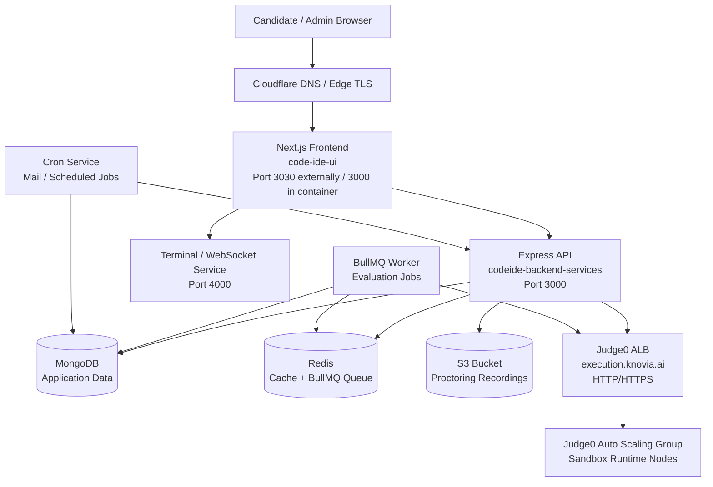
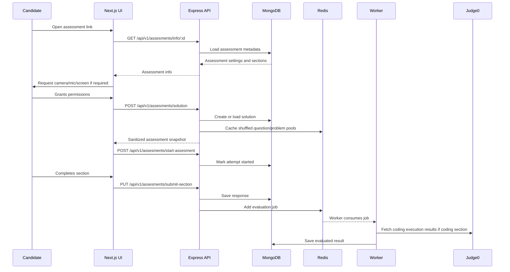
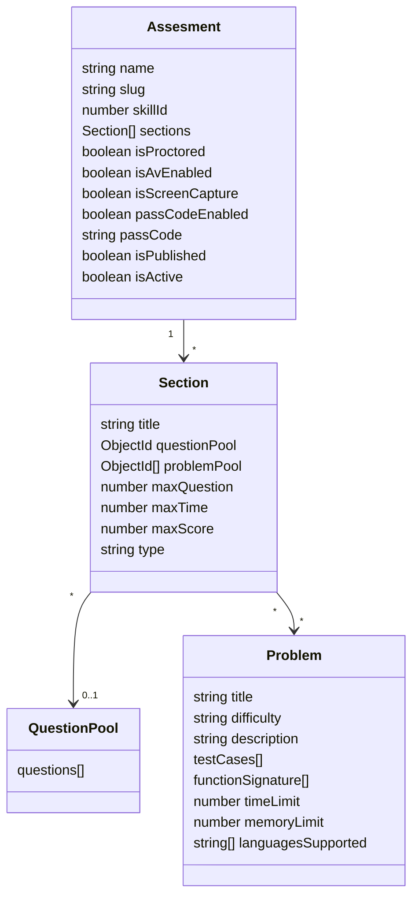
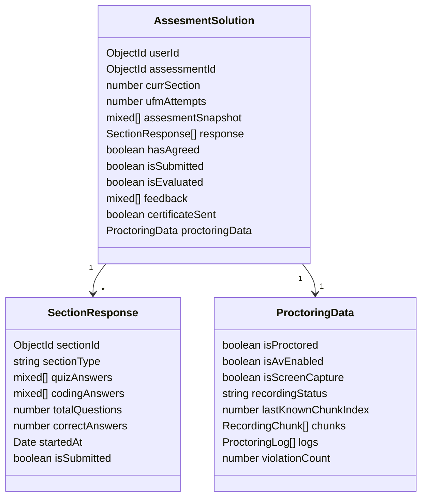
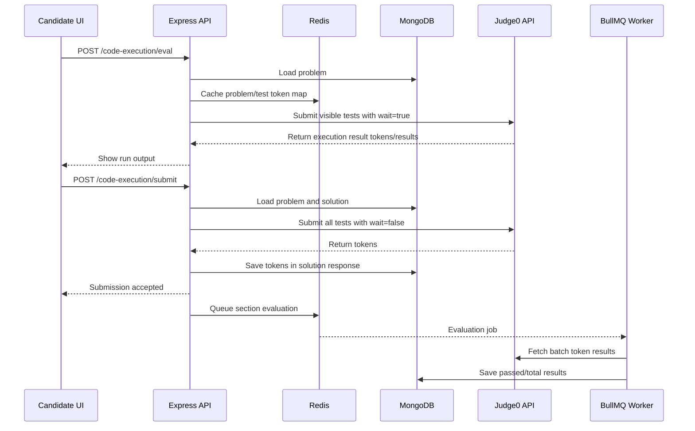
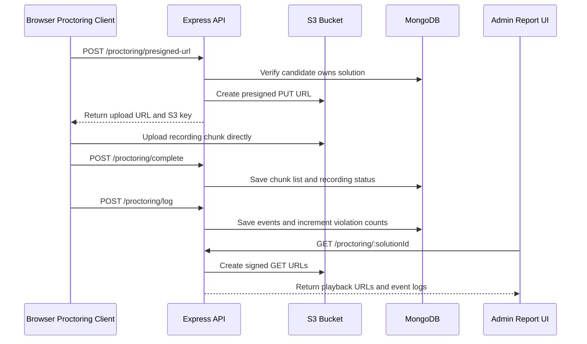
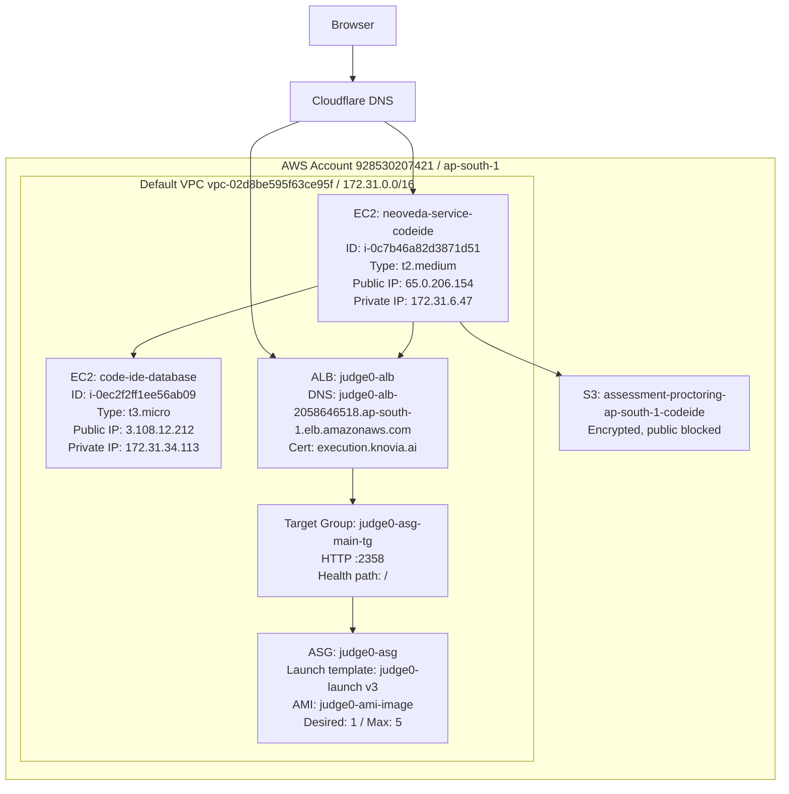
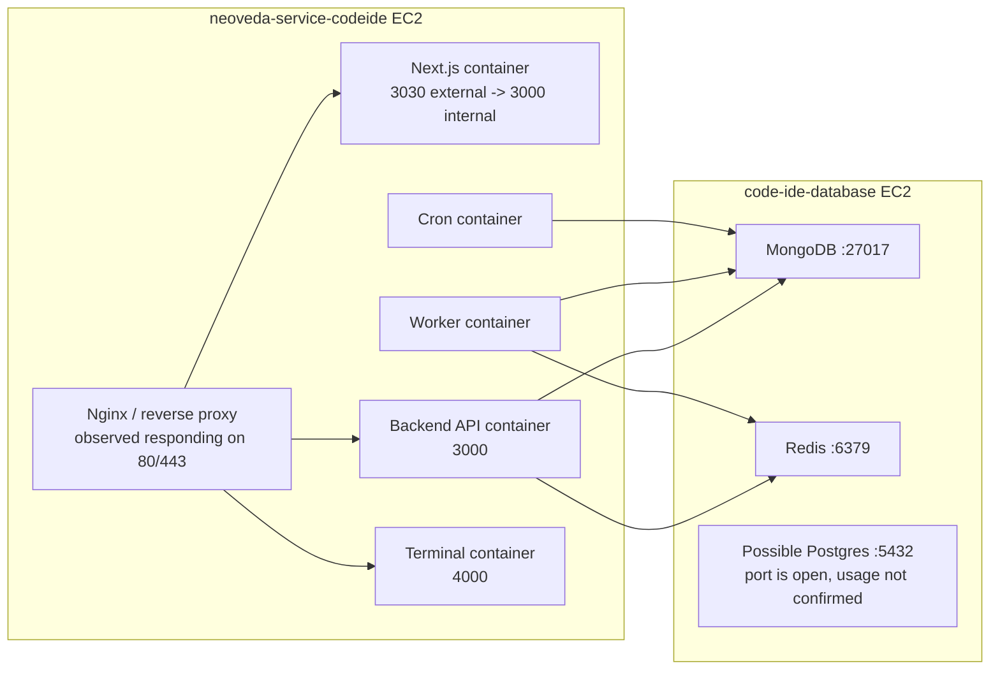

# CODE-IDE Platform Architecture

Last updated: 2026-05-08  
Repository root: `E:\Neoveda\CODE-IDE-ARYAN`

## 1. Purpose

This document explains the CODE-IDE platform architecture from product, application, infrastructure, and data-flow perspectives. It is intended for developers, architects, technical leads, and future teams who need to understand how the platform works before changing or re-hosting it.

This document covers:

- frontend architecture
- backend architecture
- assessment flow
- code execution flow
- proctoring flow
- data model boundaries
- AWS runtime architecture
- important risks and improvement areas

This document does not describe step-by-step AWS setup operations. Those are covered separately in [CODE_IDE_DEVOPS_DEPLOYMENT_RUNBOOK.md](./CODE_IDE_DEVOPS_DEPLOYMENT_RUNBOOK.md).

## 2. Executive Summary

CODE-IDE is a coding assessment platform used to create, launch, proctor, evaluate, and report candidate assessments.

The current implementation is split into two repositories:

| Layer | Repository | Purpose |
|---|---|---|
| Frontend | `code-ide-ui` | Candidate UI, admin dashboard, assessment attempt UI, report preview, proctoring UI |
| Backend | `codeide-backend-services` | Express API, MongoDB models, Redis/BullMQ worker, cron, terminal service, S3 proctoring APIs |

The current AWS deployment is mostly EC2-based:

- one EC2 instance runs the main app stack
- one EC2 instance runs MongoDB and Redis
- one Auto Scaling Group runs Judge0 code-execution nodes
- one Application Load Balancer fronts Judge0
- one S3 bucket stores proctoring recordings
- Cloudflare is expected to sit in front of the public domains

## 3. High-Level Architecture



## 4. Technology Stack

### 4.1 Frontend

| Area | Technology |
|---|---|
| Framework | Next.js `16.1.4` |
| React | React `19.2.3` |
| Language | TypeScript |
| UI framework | MUI `7.x` |
| State/data fetching | TanStack React Query |
| Forms/validation | React Hook Form, Zod |
| Code editor | Monaco Editor |
| Terminal UI | xterm.js |
| Motion | Framer Motion |
| Proctoring browser APIs | MediaRecorder, camera/mic/screen APIs |
| Face detection dependencies | TensorFlow.js, BlazeFace |
| Deployment mode | Next.js standalone output |

Important frontend files:

| File / Folder | Responsibility |
|---|---|
| `app/layout.tsx` | Root app layout and provider mounting |
| `providers/Providers.tsx` | React Query, MUI, Auth providers |
| `context/AuthContext.tsx` | Cookie-backed auth state from `/api/v1/auth/me` |
| `constants/ApiRoutes.ts` | Central API route constants |
| `app/(user)/home/page.tsx` | Candidate role/skill/assessment entry path |
| `app/(assesment)/user/page.tsx` | Candidate assessment entry route |
| `modules/assesment/components/pages/AssesmentEntry.tsx` | Assessment landing, permission checks, passcode, start flow |
| `modules/assesment/context/AssesmentContext.tsx` | Assessment attempt state |
| `modules/assesment/components/AssessmentCodeInterface.tsx` | Coding section UI |
| `modules/assesment/components/AVProctoring.tsx` | AV proctoring UI and recording behavior |
| `app/assessment/preview/[id]/page.tsx` | Report preview route |
| `app/(admin)/admin/*` | Admin dashboard pages |
| `modules/admin/*` | Admin dashboard API hooks, forms, tables, and screens |

### 4.2 Backend

| Area | Technology |
|---|---|
| Runtime | Node.js |
| API framework | Express `5.x` |
| Database ODM | Mongoose |
| Database | MongoDB |
| Queue/cache | Redis + BullMQ |
| Code execution client | Axios calls to Judge0-compatible API |
| File/object storage | AWS S3 SDK |
| Auth | JWT in httpOnly cookie |
| Security middleware | Helmet, CORS, rate limiter |
| Logging | Morgan + local Docker logs |
| PDF/certificate | PDFKit |
| Email | SendGrid / Nodemailer |
| Containerization | Docker Compose |

Important backend files:

| File / Folder | Responsibility |
|---|---|
| `assesment-platform-api/index.js` | Express app boot, middleware, DB connect, route mounts, health check |
| `config/config.js` | MongoDB, Redis, CORS, cookie, AWS config |
| `config/redisconn.js` | Redis client |
| `config/s3.js` | S3 client |
| `assesment-platform-api/routes/assesmentRouter.js` | Assessment candidate routes |
| `assesment-platform-api/routes/codeExecutionRoutes.js` | Run/submit/fetch code execution routes |
| `assesment-platform-api/routes/proctoringRoutes.js` | Proctoring upload/log/playback routes |
| `assesment-platform-api/routes/adminRoutes.js` | Admin CRUD and metrics routes |
| `assesment-platform-api/models/Assesment.js` | Assessment definition model |
| `assesment-platform-api/models/Solution.js` | Candidate attempt/solution/proctoring model |
| `assesment-platform-api/models/Problem.js` | Coding problem model |
| `assesment-platform-api/models/QuestionPool.js` | Question pool model |
| `assesment-platform-api/queue/mainQueue.js` | BullMQ queue definition |
| `assesment-platform-api/workers/worker.js` | Worker process consuming evaluation jobs |
| `assesment-platform-api/workers/evaluator.js` | Quiz/coding evaluation logic |
| `assessment-platform-cloud-service/` | WebSocket terminal service |

### 4.3 Infrastructure

| Area | Technology / AWS Service |
|---|---|
| Compute | EC2 |
| Container runtime | Docker Compose on EC2 |
| Code execution scaling | EC2 Launch Template + Auto Scaling Group |
| Code execution load balancer | Application Load Balancer |
| TLS for execution origin | AWS ACM certificate for `execution.knovia.ai` |
| Object storage | S3 bucket `assessment-proctoring-ap-south-1-codeide` |
| Network | Default VPC in `ap-south-1` |
| Static public IPs | Elastic IPs |
| DNS/CDN edge | Cloudflare, outside this AWS account |

## 5. Product Modules

### 5.1 Candidate Assessment Flow

The candidate flow allows a user to:

1. log in or be launched into the platform
2. select or open an assessment
3. pass required permission checks
4. start the assessment
5. complete quiz and/or coding sections
6. submit the assessment
7. allow the worker to evaluate the attempt
8. view a report/certificate preview



### 5.2 Admin Dashboard

The admin dashboard is implemented in `app/(admin)/admin/*` and `modules/admin/*`.

Current admin capabilities visible in the codebase:

- assessment list and CRUD
- assessment create/edit forms
- problem list and problem forms
- question pool management
- solution listing
- solution detail view
- dashboard metrics
- role, skill, and role-skill mapping APIs
- settings page

Admin routes are grouped under:

```text
/api/v1/admin
```

Frontend route examples:

```text
/admin/dashboard
/admin/assessments
/admin/assessments/new
/admin/assessments/[id]/edit
/admin/problems
/admin/problems/new
/admin/question-pools
/admin/solutions
/admin/solutions/[id]
/admin/settings
```

### 5.3 Assessment Authoring Model

Assessments are stored in MongoDB using `Assesment.js`.

An assessment contains:

- `name`
- `slug`
- `skillId`
- `sections`
- proctoring flags
- passcode settings
- publish/active flags

Each section contains:

- title
- question pool reference
- problem pool references
- max questions
- max time
- max score
- type: `quiz`, `coding`, or `mixed`



### 5.4 Candidate Attempt / Solution Model

Candidate attempts are stored in `AssesmentSolution`.

The solution stores:

- user reference
- assessment reference
- current section pointer
- UFM/proctoring counts
- immutable assessment snapshot shown to candidate
- candidate responses
- submission/evaluation flags
- proctoring recording metadata
- feedback/certificate state



## 6. Code Execution Architecture

The platform uses a Judge0-compatible execution API.

Current backend behavior:

- `/api/v1/code-execution/eval` runs sample/visible test cases and waits for output.
- `/api/v1/code-execution/submit` submits all test cases asynchronously and stores returned Judge0 tokens in the solution response.
- `/api/v1/code-execution/fetch` fetches execution result details by token.
- the evaluation worker later checks Judge0 token results and updates pass counts.

Important code locations:

- `assesment-platform-api/routes/codeExecutionRoutes.js`
- `assesment-platform-api/workers/evaluator.js`

The route file currently has a hardcoded execution API:

```text
https://execution.knovia.ai
```

The worker uses:

```text
CODE_EXECUTION_API
```

from environment variables.



## 7. Proctoring Architecture

The platform supports configurable proctoring flags at assessment level:

- `isProctored`
- `isAvEnabled`
- `isScreenCapture`

These flags are stored on the assessment and copied into the candidate solution's `proctoringData` when a solution is created.

Current backend proctoring APIs:

| Route | Purpose |
|---|---|
| `POST /api/v1/proctoring/presigned-url` | Generate S3 upload URL for a recording chunk |
| `POST /api/v1/proctoring/log` | Store proctoring events such as tab switch, no face, multiple faces |
| `POST /api/v1/proctoring/complete` | Mark recording complete and commit chunk metadata |
| `GET /api/v1/proctoring/session/:solutionId` | Resume/check candidate recording session |
| `POST /api/v1/proctoring/relay-chunk` | Upload final/unload chunk through backend relay |
| `GET /api/v1/proctoring/:solutionId` | Admin playback metadata and signed S3 playback URLs |

The S3 bucket used by the current AWS account is:

```text
assessment-proctoring-ap-south-1-codeide
```

Current bucket properties verified from AWS:

- region: `ap-south-1`
- public access block: enabled
- default encryption: SSE-S3 / AES256
- lifecycle rule: not configured



## 8. Authentication and Authorization

The current platform uses cookie-backed JWT auth.

Frontend behavior:

- `AuthContext.tsx` calls `/api/v1/auth/me`.
- Login/register calls are sent with `credentials: "include"`.
- Backend sets an httpOnly cookie.

Backend behavior:

- auth routes are mounted at `/api/v1/auth`.
- protected candidate/admin routes use `isAuthenticated`.
- admin authorization also uses `isAllowed`.

Important concern:

- `config/config.js` currently contains hardcoded JWT secret constants. These should be moved to environment variables or AWS Secrets Manager / SSM Parameter Store.

## 9. Runtime Deployment Architecture

Current AWS runtime state verified on 2026-05-08:

| Resource | State |
|---|---|
| App EC2 `neoveda-service-codeide` | running |
| DB EC2 `code-ide-database` | running |
| Judge0 ASG `judge0-asg` | desired `1`, runtime instance healthy |
| Judge0 ALB `judge0-alb` | active |
| S3 bucket `assessment-proctoring-ap-south-1-codeide` | exists |



## 10. Current AWS Resource Inventory

### 10.1 EC2

| Name | Instance ID | Type | State | Public IP | Private IP | AZ | Security Group |
|---|---|---|---|---|---|---|---|
| `neoveda-service-codeide` | `i-0c7b46a82d3871d51` | `t2.medium` | running | `65.0.206.154` | `172.31.6.47` | `ap-south-1b` | `launch-wizard-6` / `sg-0a68623cf576085d7` |
| `code-ide-database` | `i-0ec2f2ff1ee56ab09` | `t3.micro` | running | `3.108.12.212` | `172.31.34.113` | `ap-south-1a` | `launch-wizard-3` / `sg-0adafcd12643bf2d9` |
| `do-not-touch-judge0-core-ami-template-` | `i-091902efeb55f3830` | `t2.2xlarge` | stopped | none | `172.31.46.15` | `ap-south-1a` | `launch-wizard-4` / `sg-025c3af0baa54486b` |

### 10.2 Judge0 Execution Layer

| Resource | Value |
|---|---|
| ALB | `judge0-alb` |
| ALB DNS | `judge0-alb-2058646518.ap-south-1.elb.amazonaws.com` |
| ACM domain | `execution.knovia.ai` |
| Target group | `judge0-asg-main-tg` |
| Target port | `2358` |
| Health check | `/`, matcher `200` |
| Auto Scaling Group | `judge0-asg` |
| Desired capacity | `1` |
| Maximum capacity | `5` |
| Launch template | `judge0-launch`, version `3` |
| AMI | `ami-0a6ba03f90d31f8bc`, name `judge0-ami-image` |
| Runtime target health | healthy |

### 10.3 Storage

| Storage | Purpose |
|---|---|
| EC2 EBS root volume, app | 20 GB gp3 |
| EC2 EBS root volume, database | 30 GB gp3 |
| EC2 EBS root volume, Judge0 template | 30 GB gp2 |
| S3 bucket `assessment-proctoring-ap-south-1-codeide` | Proctoring camera/screen recording chunks |

## 11. Environment Variables

The platform is environment-driven. Important variables observed from code and compose files:

| Variable | Used By | Purpose |
|---|---|---|
| `NEXT_PUBLIC_API_URL` | Frontend | Base URL for backend API |
| `NEXT_PUBLIC_EXECUTION_URL` | Frontend | Execution/terminal URL where needed |
| `MONGODB_URI` | Backend and frontend Docker build args | MongoDB connection string |
| `REDIS_HOST` | Backend | Redis hostname/IP |
| `REDIS_PORT` | Backend | Redis port |
| `REDIS_PASSWORD` | Backend | Redis auth |
| `NODE_ENV` | Backend/frontend | Runtime behavior |
| `PORT` | Backend/frontend containers | Service port |
| `CODE_EXECUTION_API` | Worker | Judge0-compatible API URL |
| `EXECUTION_API` | Backend config | Execution API URL |
| `AWS_REGION` | Backend | AWS region for S3 |
| `AWS_ACCESS_KEY_ID` | Backend | S3 access |
| `AWS_SECRET_ACCESS_KEY` | Backend | S3 access |
| `S3_BUCKET_NAME` | Backend | Proctoring bucket |
| `S3_PRESIGNED_URL_EXPIRY` | Backend | Upload URL expiry |
| `S3_GET_URL_EXPIRY` | Backend | Playback URL expiry |
| `ALLOWED_ORIGINS` | Backend | CORS allowed origin |

## 12. Deployment Unit Diagram



## 13. Important Current Gaps

These are important for architecture correctness and production readiness:

- Database ports `27017`, `6379`, and `5432` are still open to `0.0.0.0/0` on the database security group. They also allow one security group source, but the public CIDR rule is still present.
- SSH `22` is open to `0.0.0.0/0` on key security groups.
- S3 proctoring bucket has encryption and public access block enabled, but no lifecycle retention rule is configured.
- CODE-IDE-specific CloudWatch log groups are not present.
- CODE-IDE-specific Secrets Manager secrets are not present.
- CODE-IDE-specific ECR repositories are not present.
- App deployment appears to be Docker Compose on EC2, not ECS/EKS/managed deployment.
- Frontend appears to be hosted from the app EC2 path rather than AWS Amplify/S3/CloudFront.
- Some source files contain encoding artifacts and misspellings such as `assesment`; avoid renaming blindly because routes and models depend on those names.

## 14. Recommended Architecture Improvements

These are not required to understand the current system, but they should be considered before scaling or handing the system to a production team:

| Priority | Improvement | Reason |
|---|---|---|
| Highest | Restrict DB ports to app security group only | Prevent public MongoDB/Redis exposure |
| Highest | Move secrets out of `.env` and hardcoded constants | Rotation, audit, and leakage control |
| Highest | Add S3 lifecycle for proctoring videos | Required retention control and cost management |
| High | Add CloudWatch log shipping | Debugging and incident review |
| High | Add EBS snapshot lifecycle for database EC2 | Recovery from disk failure |
| High | Align execution URL config | Avoid hardcoded `https://execution.knovia.ai` in code |
| Medium | Use ECR for container images | Repeatable deployments |
| Medium | Put app behind ALB or Cloudflare Tunnel | Cleaner origin routing and TLS management |
| Medium | Add IaC with Terraform/CDK | Reproducible platform creation |

## 15. Summary

CODE-IDE is currently a practical lift-and-shift style AWS deployment:

- Next.js frontend and Express backend are containerized.
- MongoDB and Redis are self-hosted on EC2.
- Judge0 is self-hosted through EC2 Auto Scaling and an ALB.
- Proctoring recordings are stored in S3.
- The app is operational but not fully production-hardened.

The architecture is understandable and workable for an MVP/product migration, but the next engineering focus should be security hardening, logging, backups, lifecycle retention, and reproducible infrastructure.
